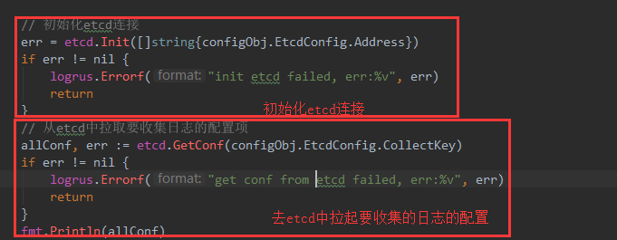

# day14日志收集项目

# 内容回顾

## context

控制goroutine,跨goroutine追踪.

### 两个根节点

* `context.Backgroud()` 
* `context.TODO()`

### 四个方法:

* `context.WithCancel()`
* `context.WithTimeOut()`
* `context.WithDeadline()`
* `context.WithValue()` 注意事项:key推荐使用自己的类型

## pprof

性能调优的两个方向:CPU和内存

`go tool pprof cpu.pprof`

`go tool pprof mem.pprof`

调用图

火焰图

## kafka

### kafka和nsq有什么区别?

nsq:更多的使用来做消息队列.

kafka:比较重量级的兼顾存储和消息队列.

### kafka的原理

见上节课的图

### Go语言往kafka中发数据

`sarama`:

windows平台要使用v1.19之前的版本

# 今日内容

## 日志收集的agent开发

### 配置文件版logagent

#### ini配置文件解析

```go
cfg , err := ini.Load("./conf/config.ini")
if err != nil {
	logrus.Error("load config failed,err:%v", err)
	return
}
kafkaAddr := cfg.Section("kafka").Key("address").String()
fmt.Println(kafkaAddr)
```

#### 初始化kafka

```go
// Init 是初始化全局的kafka Client
func Init(address []string, chanSize int64)(err error){
	// 1. 生产者配置
	config := sarama.NewConfig()
	config.Producer.RequiredAcks = sarama.WaitForAll // ACK
	config.Producer.Partitioner = sarama.NewRandomPartitioner // 分区
	config.Producer.Return.Successes = true // 确认

	// 2. 连接kafka
	client, err = sarama.NewSyncProducer(address, config)
	if err != nil {
		logrus.Error("kafka:producer closed, err:", err)
		return
	}
	// 初始化MsgChan
	MsgChan = make(chan *sarama.ProducerMessage, chanSize)
	// 起一个后台的goroutine从msgchan中读数据
	go sendMsg()
	return
}
```

#### 初始化tail

```go
func Init(filename string)(err error){
	config := tail.Config{
		ReOpen: true,
		Follow: true,
		Location: &tail.SeekInfo{Offset: 0, Whence: 2},
		MustExist: false,
		Poll: true,
	}
	// 打开文件开始读取数据
	TailObj, err =  tail.TailFile(filename, config)
	if err != nil {
		logrus.Error("tailfile: create tailObj for path:%s failed, err:%v\n", filename, err)
		return
	}
	return 
}
```

#### 收集日志发送到kafka

```go
func run ()(err error){
	// logfile --> TailObj --> log --> Client --> kafka
	for {
		// 循环读数据
		line, ok := <-tailfile.TailObj.Lines // chan tail.Line
		if !ok {
			logrus.Warn("tail file close reopen, filename:%s\n", tailfile.TailObj.Filename)
			time.Sleep(time.Second) // 读取出错等一秒
			continue
		}
		// 利用通道将同步的代码改为异步的
		// 把读出来的一行日志包装秤kafka里面的msg类型
		msg := &sarama.ProducerMessage{}
		msg.Topic = "web_log"
		msg.Value = sarama.StringEncoder(line.Text)
		// 丢到通道中
		kafka.MsgChan <- msg
	}
}
```

#### 小结


### 介绍etcd

类似于zookeeper, etcd\consul

详见`etcd.PDF`课件

E3.png)

#### etcd搭建

详见腾讯文档:[https://docs.qq.com/doc/DTndrQXdXYUxUU09O?opendocxfrom=admin](https://docs.qq.com/doc/DTndrQXdXYUxUU09O?opendocxfrom=admin)

### Go操作etcd

**注意** put是client/V3版本的命令!!!

如果使用`etcdctl.exe`来操作etcd的话,记得要设置环境变量:

```bash
SET ETCDCTL_API=3
```

Mac&Linux:

```bash
export ETCDCTL_API=3
```

#### put和set

```go
func main(){
	cli, err := clientv3.New(clientv3.Config{
		Endpoints: []string{"127.0.0.1:2379"},
		DialTimeout:time.Second*5,
	})
	if err != nil {
		fmt.Printf("connect to etcd failed, err:%v", err)
		return
	}

	defer cli.Close()

	// put
	ctx, cancel := context.WithTimeout(context.Background(), time.Second)
	_, err = cli.Put(ctx, "s4", "真好")
	if err != nil {
		fmt.Printf("put to etcd failed, err:%v", err)
		return
	}
	cancel()

	// get
	ctx, cancel = context.WithTimeout(context.Background(), time.Second)
	gr, err := cli.Get(ctx, "s4")
	if err != nil {
		fmt.Printf("get from etcd failed, err:%v", err)
		return
	}
	for _, ev := range gr.Kvs{
		fmt.Printf("key:%s value:%s\n", ev.Key, ev.Value)
	}
	cancel()
}
```

#### watch

监控etcd中key的变化(创建\更改\删除)

```go
func main(){
	cli, err := clientv3.New(clientv3.Config{
		Endpoints: []string{"127.0.0.1:2379"},
		DialTimeout:time.Second*5,
	})
	if err != nil {
		fmt.Printf("connect to etcd failed, err:%v", err)
		return
	}
	defer cli.Close()

	// watch
	watchCh := cli.Watch(context.Background(), "s4")

	for wresp := range watchCh{
		for _, evt := range wresp.Events{
			fmt.Printf("type:%s key:%s value:%s\n", evt.Type, evt.Kv.Key, evt.Kv.Value)
		}
	}
}
```

#### kafka消费

```go
package main
import (
	"fmt"
	"github.com/Shopify/sarama"
	"sync"
)
// kafka consumer(消费者)

func main(){
	// 创建新的消费者
	consumer, err:= sarama.NewConsumer([]string{"127.0.0.1:9092"}, nil)
	if err != nil {
		fmt.Printf("fail to start consumer, err:%v\n", err)
		return
	}
	// 拿到指定topic下面的所有分区列表
	partitionList, err := consumer.Partitions("web_log") // 根据topic取到所有的分区
	if err != nil {
		fmt.Printf("fail to get list of partition:err%v\n", err)
		return
	}
	fmt.Println(partitionList)
	var wg sync.WaitGroup
	for partition := range partitionList{ // 遍历所有的分区
		// 针对每个分区创建一个对应的分区消费者
		pc, err := consumer.ConsumePartition("web_log", int32(partition),sarama.OffsetNewest)
		if err != nil {
			fmt.Printf("failed to start consumer for partition %d,err:%v\n",
				partition, err)
			return
		}
		defer pc.AsyncClose()
		// 异步从每个分区消费信息
		wg.Add(1)
		go func(sarama.PartitionConsumer){
			for msg:=range pc.Messages(){
				fmt.Printf("Partition:%d Offset:%d Key:%s Value:%s",
					msg.Partition, msg.Offset, msg.Key, msg.Value)
			}
		}(pc)
	}
	wg.Wait()
}
```

### 总结

上午版本的logagent还存在以下问题:

1. 只能读取一个日志文件,不支持多个日志文件
2. 无法管理日志的topic

**思路:**

用etcd存储要收集的日志项,使用json格式数据:

```json
[
 {
     "path": "d:\logs\s4.log",
     "topic": "s4_log",
 },
 {
         "path": "e:\logs\web.log",
         "topic": "web_log",
 },
]
```

### lagagent使用etcd管理收集项





`Init`

```go
func Init(address []string)(err error){
	client, err = clientv3.New(clientv3.Config{
		Endpoints: address,
		DialTimeout:time.Second*5,
	})
	if err != nil {
		fmt.Printf("connect to etcd failed, err:%v", err)
		return
	}
	return
}
```

`GetConf`

```go
// 拉取日志收集配置项的函数
func GetConf(key string)(collectEntryList []collectEntry, err error){
	ctx, cancel := context.WithTimeout(context.Background(), time.Second*2)
	defer cancel()
	resp, err := client.Get(ctx, key)
	if err != nil {
		logrus.Errorf("get conf from etcd by key:%s failed ,err:%v",key, err)
		return
	}
	if len(resp.Kvs) == 0 {
		logrus.Warningf("get len:0 conf from etcd by key:%s",key)
		return
	}
	ret := resp.Kvs[0]
	// ret.Value // json格式字符串
	fmt.Println(ret.Value)
	err = json.Unmarshal(ret.Value, &collectEntryList)
	if err != nil {
		logrus.Errorf("json unmarshal failed, err:%v", err)
		return
	}
	return
}
```

#### 为每个单独的配置项启动tailTask


#### 管理日志收集项

程序启动之后,拉去了最新的配置之后,就应该派一个小弟去监控etcd中 `collect_log_conf`这个key的变化


#### 暂留的问题

如果logagent停了需要记录上一次的位置,参考filebeat


# 作业

1. 把Go语言操作etcd的例子自己写一遍
2. 自己实现以下logagent


