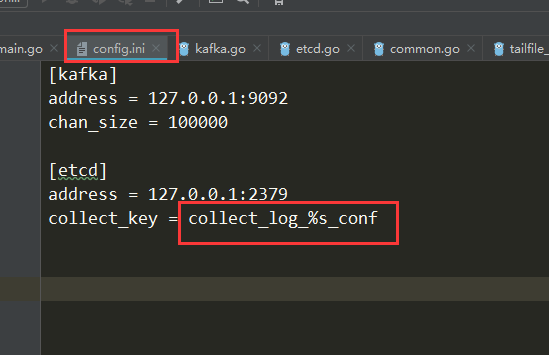
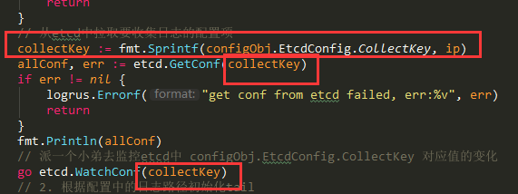
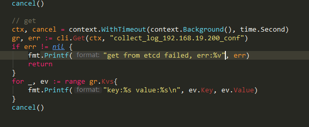
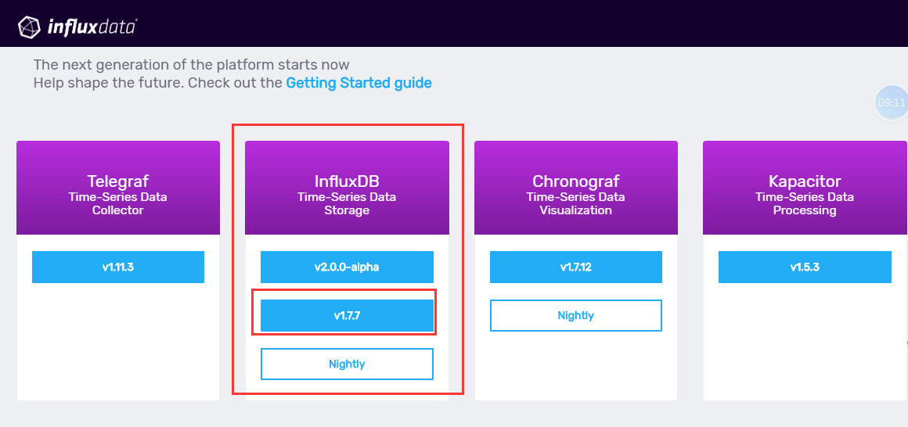
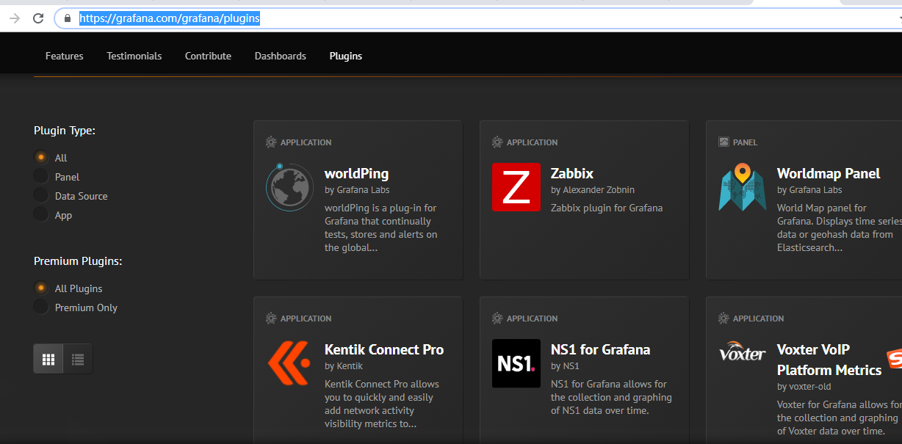

# day15课上笔记

# 内容回顾


## logagent流程梳理

[logagent流程](https://www.processon.com/view/link/5d3d05a4e4b0b3e4dcd547ec)


## logagent

每台服务器上的logagent的收集项可能都不一致,我们需要让logagent去etcd中根据IP获取自己的配置



### 如何获取本机的IP

```go
func GetLocalIP() (ip string, err error) {
	addrs, err := net.InterfaceAddrs()
	if err != nil {
		return
	}
	for _, addr := range addrs {
		ipAddr, ok := addr.(*net.IPNet) // 类型断言
		if !ok {
			continue
		}

		if ipAddr.IP.IsLoopback() {
			continue
		}

		if !ipAddr.IP.IsGlobalUnicast() {
			continue
		}
		fmt.Println(ipAddr)
		return ipAddr.IP.String(), nil
	}
	return
}


// Get preferred outbound ip of this machine
func GetOutboundIP() string {
	conn, err := net.Dial("udp", "8.8.8.8:80")
	if err != nil {
		log.Fatal(err)
	}
	defer conn.Close()

	localAddr := conn.LocalAddr().(*net.UDPAddr)
	fmt.Println(localAddr.String())
	return localAddr.IP.String()
}
```

### logagent中集成根据ip拉取配置



### etcd中配置的key要注意使用IP



# 今日内容

## gopsutil包

[博客地址](https://www.liwenzhou.com/posts/Go/go_gopsutil/)

## influxDB时序数据库

### 安装

[官网下载页面](https://portal.influxdata.com/downloads/)



#### Windows

[下载链接:https://dl.influxdata.com/influxdb/releases/influxdb-1.7.7_windows_amd64.zip](https://dl.influxdata.com/influxdb/releases/influxdb-1.7.7_windows_amd64.zip)

#### Mac

[下载链接:https://dl.influxdata.com/influxdb/releases/influxdb-1.7.7_darwin_amd64.tar.gz](https://dl.influxdata.com/influxdb/releases/influxdb-1.7.7_darwin_amd64.tar.gz)

或者:

```bash
brew update
brew install influxdb
```


##### 基本命令

[官方文档:https://docs.influxdata.com/influxdb/v1.7/introduction/getting-started](https://docs.influxdata.com/influxdb/v1.7/introduction/getting-started)

## grafana

展示数据的工具,监控数据可视化

* 搜索引擎找官网

#### 下载

[下载地址:https://grafana.com/grafana/download](https://grafana.com/grafana/download)

#### 安装

解压

把`conf/sample.ini`复制一份然后重命名为`conf/custom.ini`

在解压目录下,执行

`bin\grafana-server.exe` 默认在本机的`:3000`端口启动


默认账号密码都是:admin


### grafana安装插件

[浏览插件仓库:https://grafana.com/grafana/plugins](https://grafana.com/grafana/plugins)



选择自己要安装的插件,然后按照提示安装即可.

例如,要安装[饼图插件:https://grafana.com/grafana/plugins/grafana-piechart-panel](https://grafana.com/grafana/plugins/grafana-piechart-panel)

在grafana目录下面,执行以下命令:

```bash
grafana-cli.exe plugins install grafana-piechart-panel
```

然后重启grafana即可.


更多细节请看视频.

# 作业

把课上收集系统信息的代码自己实现一遍.

然后把收集系统信息的代码集成到logagent中.


