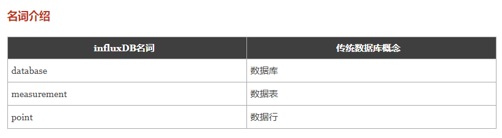
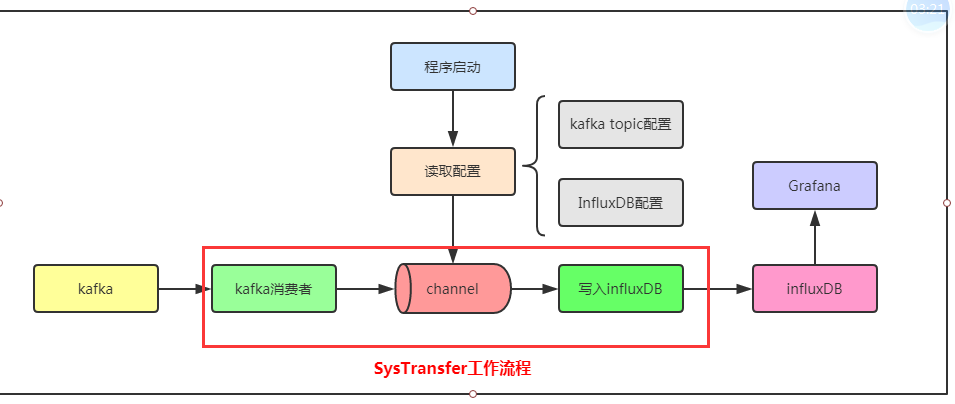
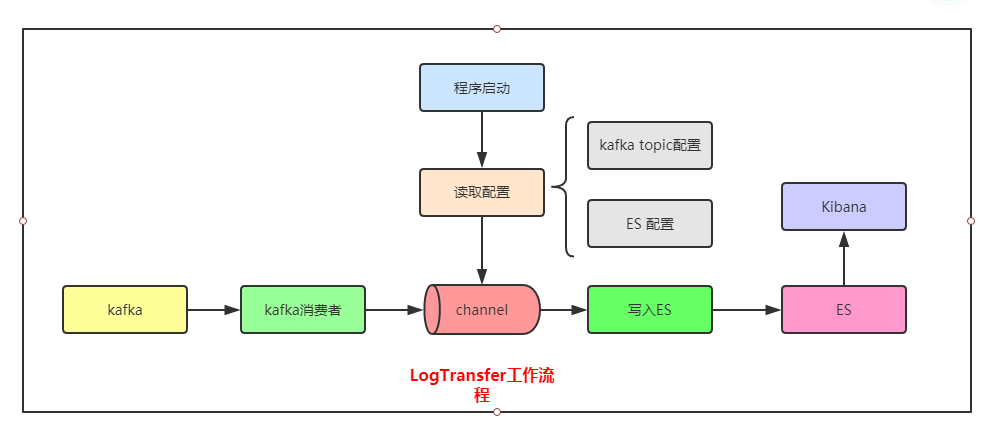
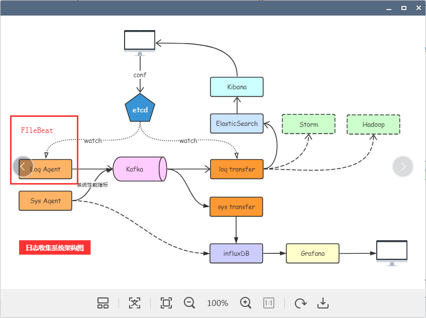

# day16课上笔记


# 内容回顾

## gopsutil包

`gopsutil`是`psutil`的Go语言版本. go语言开发

在Windows下面一些指标例如`innodes`数据是获取不到.

[博客链接](https://www.liwenzhou.com/posts/Go/go_gopsutil/)

## influxDB

### influxDB介绍

时序数据库,开源,Go开发的,

集群功能是收费的

类似项目:`OpenTSDB`

### influxDB操作



插入数据操作,记得`tags`和`fields`的区别

以各个城市的气象数据为例,我们要写入influxDB,其中

北京\上海\深圳这些是要作为`tags`

温度\湿度\降雨量这些是作为`fields`

```go
func writesPoints(cli client.Client) {
	bp, err := client.NewBatchPoints(client.BatchPointsConfig{
		Database:  "test",
		Precision: "s", //精度，默认ns
	})
	if err != nil {
		log.Fatal(err)
	}
	tags := map[string]string{"cpu": "ih-cpu"}
	fields := map[string]interface{}{
		"idle":   201.1,
		"system": 43.3,
		"user":   86.6,
	}

	pt, err := client.NewPoint("cpu_usage", tags, fields, time.Now())
	if err != nil {
		log.Fatal(err)
	}
	bp.AddPoint(pt)
	err = cli.Write(bp)
	if err != nil {
		log.Fatal(err)
	}
	log.Println("insert success")
}
```

### Grafana

数据可视化工具,支持很多种数据源.丰富的图表而且还支持插件,最新的版本也支持告警功能

后端也是使用Go语言开发,支持类似SQL那种查询方式

## 作业




# 今日内容

## Elastic search

开源的搜索引擎,java开发,基于`Lucene`

#### 倒排索引(reversed index)

1. 沙河有沙又有河
2. 沙河人杰地灵
3. 沙河好

分词 

关键词的权重

关键词的出现的频次

河:1:[2],2:[1],3:[1]

 好

人


Kibana




完整的项目架构图




[FileBeat](https://github.com/elastic/logstash-forwarder)

### 复习

9天基础

* 数据类型
* 变量和常量
* 流程控制语句
* 运算符
* 函数
* **结构体**
* **接口**
* 反射
* **并发**
* 测试和pprof
* 网络编程
* 数据库
* **context**

3天的gin框架 `crud boy`

	* gin框架的使用
	* ginsession中间件   --> Redis

4天日志收集项目

* logagent
  * `etcd`:put\set\watch 类似的项目`consul`
  * `tail`
  * `kafka` kafka的组件\内部的原理
  * zookeeper
* sys agent :
  * `gopsutl`:`类似的现成的监控`open-falcon`
  * `influxDB` 类似的项目还有`openTSDB`
  * `grafana`
* log transfer
  * Elasticsearch:各个概念和内部的组件构成
  * Kibana:可视化

### 面试题

[面试题大礼包](https://docs.qq.com/doc/DTkJ3THFtakZocWFF?opendocxfrom=admin)

[2019年面试题](https://docs.qq.com/doc/DTkJjdXJZbGZEUk1S?opendocxfrom=admin)

[快速排序\归并排序\堆排序](https://www.liwenzhou.com/posts/Go/go_algorithm/)

# 今日分享

1. 在公司里勇挑重担,替领导分忧,不要等机会要学会自己创造机会,努力向上发展.
2. 学会舔人
3. 现在学历很重要,未来学历更重要.学历有短板,早点补.

